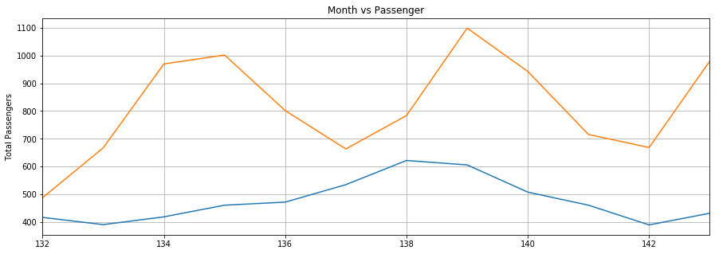

# Flight-passenger-prediction-LSTM-pytorch
Predicting the number of flight passengers using LSTM in pytorch.
This repo shows prediction of flight passenger using LSTM model.The Data has been taken from the seaborn library
The repo implements a simple network for it in pytorch :
```python

class LSTM(nn.Module):
    def __init__(self, input_size=1, hidden_layer_size=100, output_size=1):
        super().__init__()
        self.hidden_layer_size = hidden_layer_size

        self.lstm = nn.LSTM(input_size, hidden_layer_size)

        self.linear = nn.Linear(hidden_layer_size, output_size)

        self.hidden_cell = (torch.zeros(1,1,self.hidden_layer_size),
                            torch.zeros(1,1,self.hidden_layer_size))

    def forward(self, input_seq):
        lstm_out, self.hidden_cell = self.lstm(input_seq.view(len(input_seq) ,1, -1), self.hidden_cell)
        predictions = self.linear(lstm_out.view(len(input_seq), -1))
        return predictions[-1]
```
## loss function Vs Epoches

## Data distribution across month

## Plots for prediction


